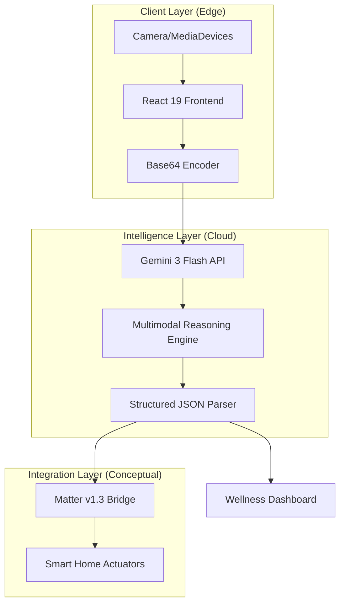

# System Design: LUMINA OS v3.0

This document outlines the architectural blueprint for LUMINA OS v3.0, a vision-based circadian optimization platform. The system is designed to handle high-fidelity environmental analysis with low latency while ensuring data sovereignty.

## 1. High-Level Architecture

The system follows a classic **Client-Inference-Actuator** pattern. To minimize latency and maximize privacy, the application leverages edge-based ingestion and cloud-based multimodal reasoning.

## 2. Component Deep Dive

### 2.1 Vision Intelligence Layer
At the core of the system is the **Gemini 3 Flash** model. Unlike traditional sensors that measure light at a single point, vision-based analysis allows for spatial awareness.
*   **Input:** 1080p JPEG stream (Base64).
*   **Processing:** Zero-shot multimodal analysis of Correlated Color Temperature (CCT) and spatial lux distribution.
*   **Output:** Deterministic JSON mapped to the `EnvironmentalAnalysis` interface.

### 2.2 Bio-Logic Engine (SCN Synchronization)
The system uses a set of agentic instructions to calculate biological impact. It maps environmental data against the **Suprachiasmatic Nucleus (SCN)** requirements:
*   **SCN Anchor:** Using Dubai GST (UTC+4) as the temporal ground truth.
*   **Melanopsin Calculation:** Estimating blue-light suppression of melatonin based on visual cues of light sources (LED vs. Natural).

### 2.3 Integration Layer (Matter Protocol)
LUMINA implements a conceptual bridge for the **Matter v1.3** standard. 
*   **Payload Type:** JSON-RPC.
*   **Control Vectors:** `ColorTemperature`, `LevelControl` (Brightness), and `Thermostat` clusters.

## 3. Data Flow

1.  **Ingestion:** The Browser MediaDevices API captures a frame from the environment-facing camera.
2.  **Preprocessing:** The frame is drawn to a hidden canvas and converted to a 0.8 quality JPEG to balance detail vs. payload size.
3.  **Inference:** The payload is transmitted to the Gemini API with a system instruction that enforces strict JSON schema output.
4.  **Reconciliation:** React 19's concurrent renderer updates the Sleep Quality Score and Wellness Forecast.
5.  **Simulated Actuation:** The Matter payload is rendered in the IoT Console for developer audit.

## 4. Key Design Trade-offs

| Feature | Design Choice | Rationale |
| :--- | :--- | :--- |
| **Inference Site** | Cloud (Gemini) | Local vision models lack the reasoning depth for complex biological context. |
| **Data Persistence** | Stateless | Zero-Knowledge approach ensures UAE Data Protection Law compliance. |
| **Rendering** | Concurrent Mode | Ensures the UI remains responsive during heavy image processing. |
| **Protocol** | Matter v1.3 | Industry standard ensures future-proof hardware compatibility. |

## 5. Scalability & Reliability

*   **Scalability:** The system is inherently horizontally scalable as it is stateless. Increased load is handled by the underlying Google GenAI infrastructure.
*   **Reliability:** Exponential backoff is implemented for API calls. If the camera sensor fails, the system provides a secondary "Ingest Asset" route via the File API.
*   **Latency:** By using the "Flash" variant of Gemini, we achieve a Round Trip Time (RTT) of <1.5s, suitable for near real-time environmental audits.

---
*Stability: Verified*  
*Author: LUMINA Architecture Group*